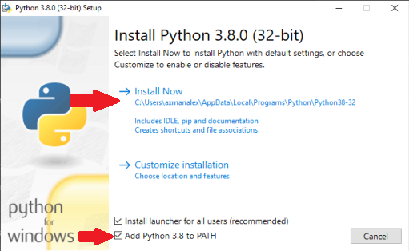
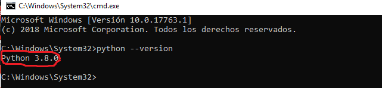
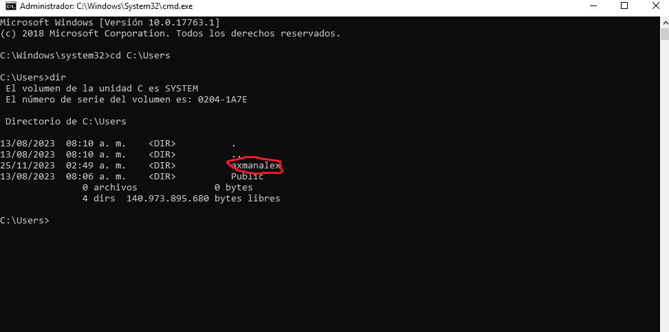
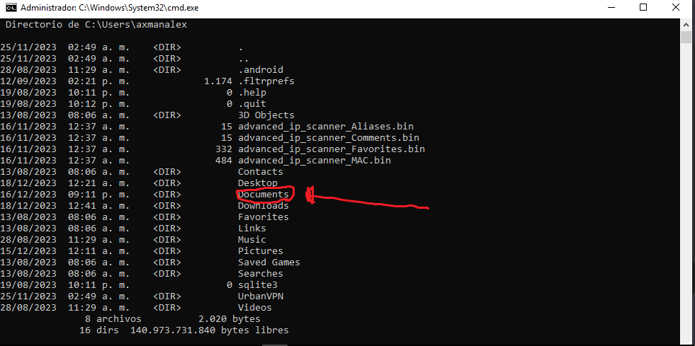
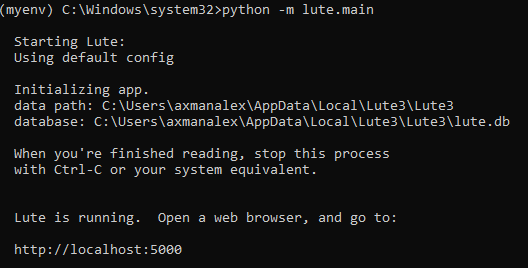

# Windows 10 (32 bit) using Python

_(Instructions courtesy of user `axmanalex`, so you'll see that username in these notes.)_

A summary of what you're doing:

1. Download and install [Python 3.8.0](https://www.python.org/downloads/windows/), and put Python on your system `PATH`
2. Create a directory in your Documents
3. Install Lute into a virtual environment, and start it up.

## Detailed instructions

1. Download Python version 3.8.0: [https://www.python.org/downloads/windows/](https://www.python.org/downloads/windows/)

2. Install Python with admin privileges, tick "Add python 3.8 to PATH" and click on install.



3. When the install is done, open CMD with admin privileges and write "python --version" to check it works.  You should see something like the below:



4. Still in CMD, type `cd C:\Users`, hit Enter, then type `dir` and hit Enter.  Your screen should look like this:



This shows all users on your machine.

5. Now you'll `cd` (change directory) to your personal user directory.  This user's name was `axmanalex`, so he wrote

```
cd axmanalex
```

and then hit Enter.

Use your own user name instead of `axmanalex`, and hit Enter.  Then type `dir` and hit Enter.  Your screen should look like this:



6. You'll install Lute in one of your personal folders.  axmanalex chose to install it in `Documents`, so he wrote

```
cd Documents
```

and hit Enter.

Replace `Documents` with where you want to put Lute.

7. Make a folder for Lute with the following commands (hit Enter after each line):

```
mkdir my_lute
cd my_lute
```

8. Create and activate your "virtual environment" with the following commands (hit Enter after each line):

```
python -m venv myenv
.\myenv\Scripts\activate.bat
```

9. Install Lute

```
pip install --upgrade lute3
```

and press Enter.
 
Lute will now start to download and install all the components.  Errors will be printed as red text -- if you get any errors, google for solutions or ask for help in Discord.

10. Start it up!

```
python -m lute.main
```

and press Enter.  The screen should look something like this:



The server should be running.

Open any browser (Chrome, Firefox, etc), and go to [http://localhost:5000/](http://localhost:5000/).  It should look like this:


... and that's it, you're up and running!

Leave this command prompt window running while you're using Lute.

## Stopping Lute

When you're done, if you want to stop the server, press Ctrl + C on your cmd and close it.

## Restarting Lute

To run the server again, open CMD again with admin privileges, and at the prompt enter the following commands (hitting Enter after each line):

```
cd C:\Users\ ... path to your lute ...\
.\myenv\Scripts\activate.bat
```

Note that the route depends on where you installed your Lute.  Here's what axamanalex writes:

```
cd C:\Users\axmanalex\Documents\my_lute
.\myenv\Scripts\activate.bat
```

Then start Lute again:

```
python -m lute.main
```

and press Enter.  The server starts again.