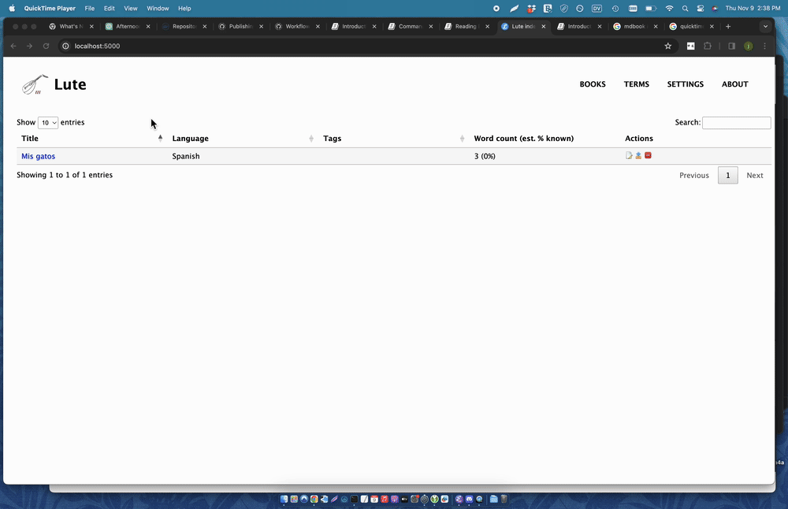

# Introduction

LUTE (Learning Using Texts) is a standalone web application that you install on your computer and read texts with.

Lute contains the core features you need for learning through reading:

* defining languages and dictionaries
* creating and editing texts
* creating terms and multi-word terms

In addition, Lute has features missing from other tools, which I consider absolutely essential:

* Defining "parent terms".  For example, for Spanish, _hablar_ (to speak) is the root form of _habló_ (he spoke).  In Lute, you can set a root form as the Parent Term, and the definition for that root form is available for all child terms.  Also, when you ask Lute for sample sentences using a term, it includes sentences for all related terms as well.
* Adding word images.  This helps learning, and is more interesting and entertaining than adding reams of text.

This 5-minute video gives a very brief demonstration and shows how easy it is to install Lute:

<iframe width="720" height="615"
src="https://www.youtube.com/embed/7X3OkcljoCk">
</iframe>

Lute has many other features, see the sidebar and browse around.

Lute is a work in progress, as is all software, but it works.  I've been using it to learn Spanish, and it's super.

