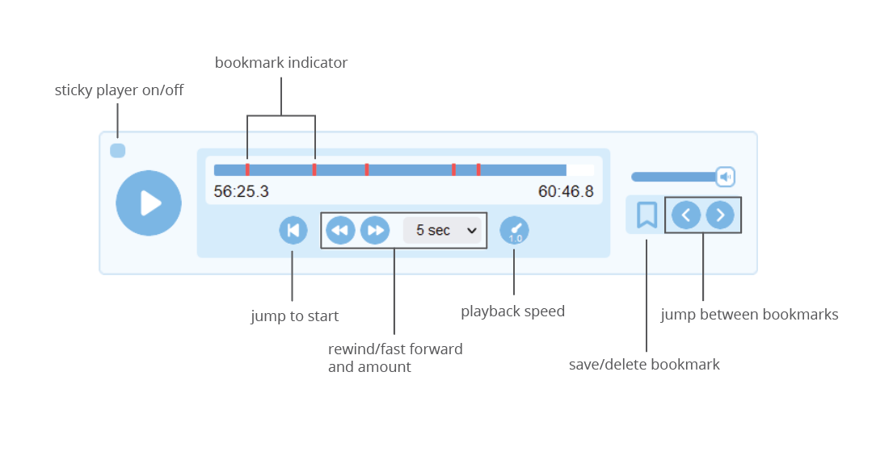

# Adding audio

_Feature added in Lute 3.0.5_

Lute lets you add an audio file (.mp3, .wav, .ogg) to any book so you can listen to your book as you read.

## Adding audio

You can add audio to a new book during creation, or to an existing book using the "Edit" action in the book listing.

Lute stores a copy of the added audio in your `data` folder, in the same folder where it stores your database and user images.

## The player

If your book has an audio file, a player is included on the reading page:

You can do the usual things: start and pause the player (either with the buttons or the space bar), and fast-forward and rewind.  The "sticky player" toggle sticks the player to the bottom of the screen.

You can increase and decrease the playback speed by hovering over the playback speed control and scrolling up or down.  Clicking it resets the playback speed to 1.0, the regular speed.

When you start the player, it plays until you stop it, or until you open the Term form by clicking on a word or defining a new multi-word Term.  Once you've defined a term, click Play to restart the player from where it stopped.

## Bookmarks

You can add and remove bookmarks to your book's audio, and jump back and forth along the timeline to your bookmarks.

Lute's audio playback is **not** syncronized with the text or pages in any way, so for multi-page books with audio, you'll likely want to use bookmarks to note the start of each page.  If you move back and forth between pages, the player doesn't follow you.

## Suggestions for using audio

_A suggestion only, do how you see fit!_

* Do several passes through the book and audio, marking each new page with a bookmark, adding any new Terms as needed.
* Re-listen and read along
* Listen to the audio alone

### Why isn't the player synced with the pages?

Good question.  There are a few reasons, none of which may satisfy you!

* Currently, Lute lets you add an arbitrary number of bookmarks to each book audio.  There is no simple way to differentiate between an arbitrary bookmark vs. a special bookmark indicating the start of a page.
* I believe that audio books are vital for the beginning and intermediate phases of learning, for which the reading materials are likely going to be short.  Syncing is not as critical here, as you will be able to find the accompanying portion of the audio track easily using simple bookmarks.

Syncing audio to page turns is possible, and perhaps will be delivered at some point in the future (if a developer really wants it!).  Having used this feature myself, I find the current implementation completely satisfactory -- I rarely jump around to random pages in lengthy texts.

Lute's still open source software, so we do the best we can in the time we have available to work on it!