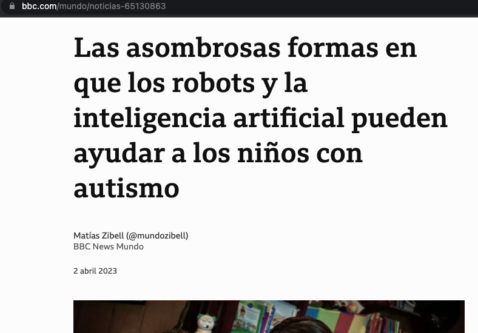
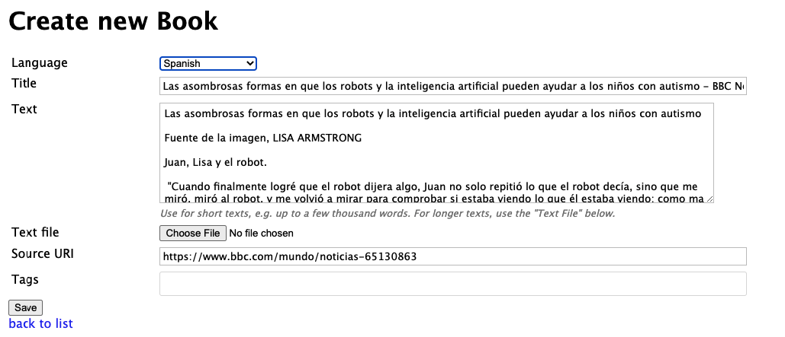

# Creating books

## From input or files

You can create books by importing files (.txt or .epub) or just entering text into a text box.

## Importing web pages

From Books > Import web page, you can import a new text to read in your target language.

For example, a good source for Spanish news is bbc.com/mundo.  If you find a story that's interesting:

Copy the URL `https://www.bbc.com/mundo/noticias-65130863` and paste it in the text box:

Lute throws the whole page content into a new Book import screen:

You **will** want to edit the Text box content, because the import pulls in pretty much everything.  It's not perfect, but it lets you quickly get new content loaded.
