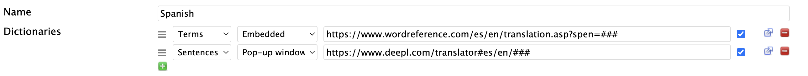
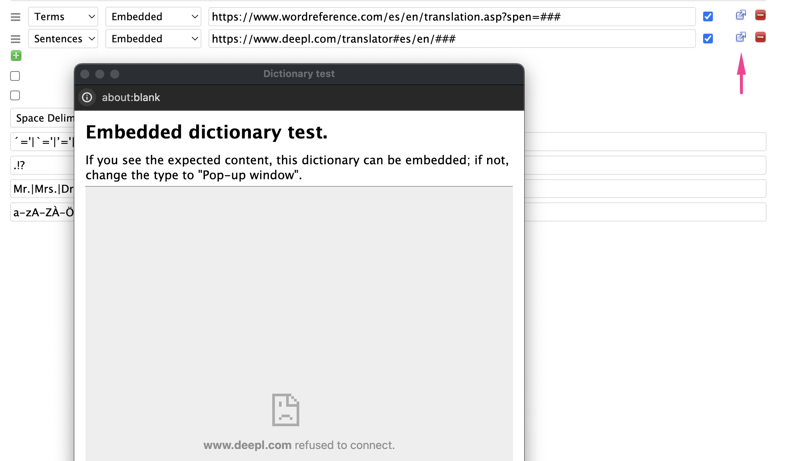

# Dictionaries

You can add multiple dictionaries for Term and Sentence lookups as part of your Language definition.

Term dictionaries are shown as tabs in the term form.

Sentence dictionaries are used during sentence translation, when you hover over a term and hit the `t` hotkey.  If you have multiple Sentence dictionaries, you can cycle through them by repeatedly hitting `t` (or `Shift + t` for the paragraph).

## Embedded or Popup

Dictionaries can either be configured to be "Embedded" or "Pop-up".

Some sites, like DeepL and Google Translate, don't work when embedded within sites.  These sites have to be viewed in separate pop-up windows, outside of Lute itself.
  
You can test a dictionary by clicking the small "out arrow" icon next to the dictionary.  For example, here I've tried to set DeepL.com as an embedded dictionary, which they don't allow:

## The dictionary URL

The dictionary link entry on the form must contain "###".  Lute substitutes that with the actual term you're looking up.

Some dictionaries don't take parameters at all.  For example, `https://www.cherokeedictionary.net/###` gives an error.  In these cases, add a fake parameter, e.g. `https://www.cherokeedictionary.net?lute=###`.[^linkhack]

## Misc notes

* Reorder the dictionaries by dragging the drag handle on the left hand side up and down.
* Some dictionary sites may occasionally be unavailable, so you can deactivate them in your language by un-checking the checkbox.
* Delete dictionaries with the delete button, and add a new one with the green plus.
* Save the Language to save your dictionary changes.

---

[^linkhack] This is a hack.  There's an issue to remove the requirement for a ### parameter.
