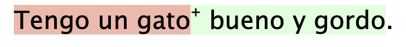
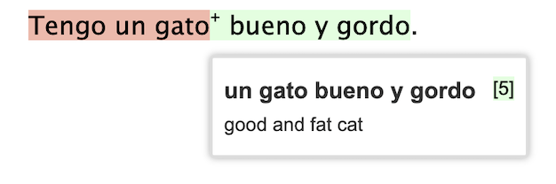
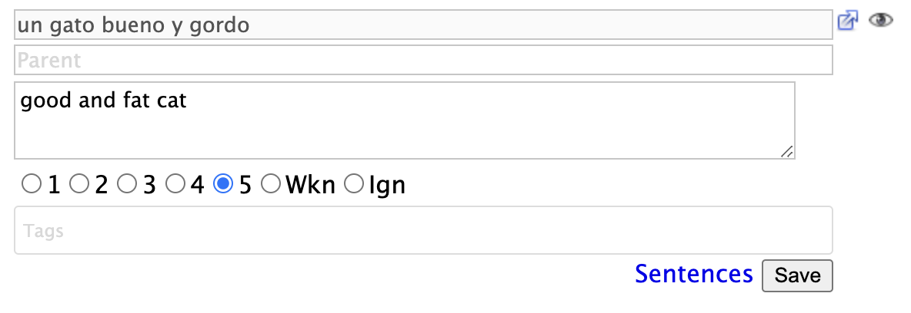
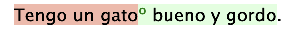

# Overlapping terms

Sometimes Terms you define may "overlap", so Lute displays those with an extra indicator.

For example, suppose you're studying Spanish, and you have already defined two Terms: "tengo un gato", and "un gato bueno y gordo" (with different Statuses, one is new, the other is easy).  If you were reading a book with text "Tengo un gato bueno y gordo.", Lute displays that like this:



The small "+" sign next to the "bueno y gordo" indicates that the full Term "un gato bueno y gordo" is _partially overlapped by the preceding term.

If you hover over the "+ bueno y gordo", you'll see the full term:



and clicking on it will open the Term form with the full term as well:



If you don't like the "+" sign as the overlap indicator, you can customize it using a custom style:

```
/* content in data/custom_styles/custom_styles.css */
span.overlapped:before {
   content: "\00BA";
   color: green;
}
```

which gives this:

