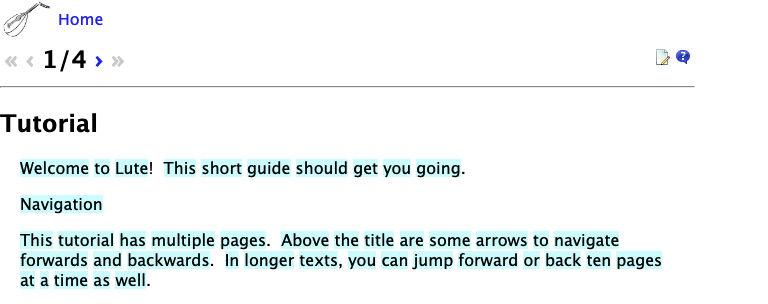
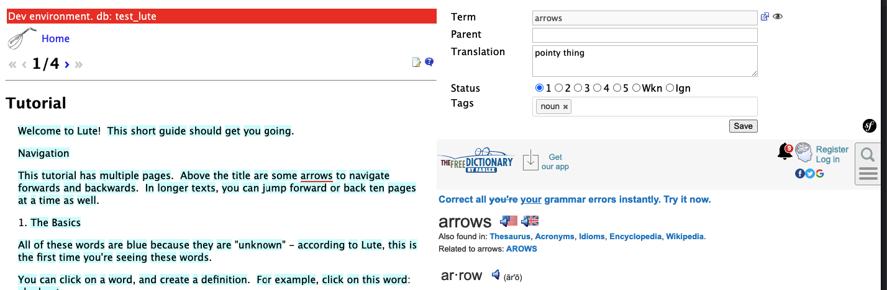
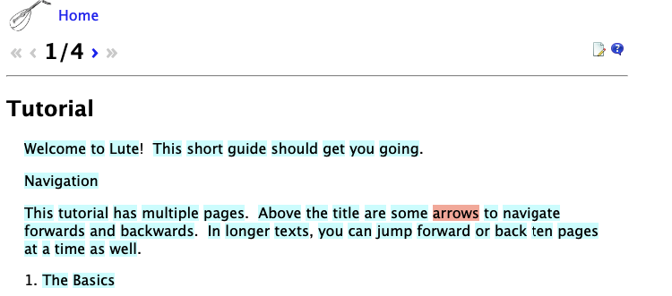
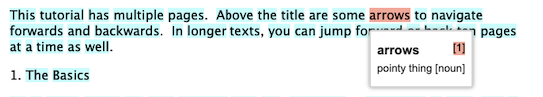
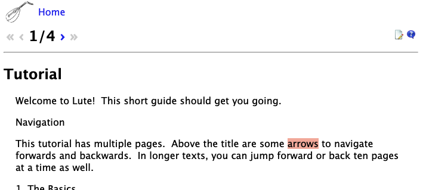

# Reading

Lute comes with a Tutorial demo (you can find the text [here](./tutorial.md)).  Here's a very brief overview of the key features:

_(Note: This page is slightly out of date, but the ideas are the same)_

When you first open a text, it will look something like this:

All of these words are blue because they are "unknown" - according to Lute, this is the first time you're seeing these words.

If you click on a word, you can add a definition and some detail:

When you save the term, the reading pane is updated:

If you hover over the word, the information is shown in a pop-up:

When you are done reading a page, you can mark any remaining terms as "well known" using the checkmark buttons at the bottom of the page:

The green checkmark sets any blue items to "well known", the checkmark with the ">" sets all to well-known and moves to the next page.

Here's what the page looks like after the green checkmark is clicked:

Lute has other features like hotkeys to quickly set term statuses (New, Learning, Well-known, Ignore), bulk updates, parent terms, term images, etc.  These are documented in the Tutorial, which you can walk through when you first install Lute.
