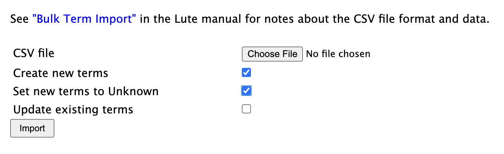
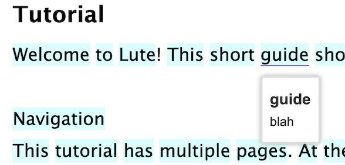

# Bulk term import

If you have existing vocabulary lists, you can bulk import new Terms, or update existing Terms, with a properly-formatted CSV file.

From the menu, click Terms > Import Terms.  Choose the CSV file, and indicate if you want to import new Terms, update existing ones, or both.

<!-- TOC start (generated with https://github.com/derlin/bitdowntoc) -->

- [CSV File Format](#csv-file-format)
   * [Field notes](#field-notes)
   * [Examples](#examples)
      + [ex. 1 - single record](#ex-1---single-record)
      + [ex. 2 - carriage return in field](#ex-2---carriage-return-in-field)
      + [ex. 3 - parent record](#ex-3---parent-record)
      + [ex. 4 - translation only](#ex-4---translation-only)
      + [ex. 5 - multiple parents](#ex-5---multiple-parents)
- [Creating CSV files](#creating-csv-files)
- [Importing new terms as "Unknown"](#importing-new-terms-as-unknown)

<!-- TOC end -->


## CSV File Format

* The CSV file should be properly formatted; i.e., carriage returns in fields are allowed, but the field should be enclosed in quotes.
* The first line of the CSV file **must** have the field headings: `language, term`
* The first line of the CSV file may also have any of these headings: `translation, parent, status, tags, pronunciation, link_status`
* Fields can be in any order.
* An error is raised if the file contains other headings.

### Field notes

| Field | Required | Notes |
| --- | --- | --- |
| language | Yes | Must be the name of one of the languages you have saved in Lute |
| term | Yes | The new Term |
| translation | | |
| parent | | The "parent" of this term (e.g., an infinitive form of a verb, etc.).  This will automatically create the parent term if it doesn't exist already, or if it's not created in the same import file.  If a term has multiple parents, you can enclose the list in quotes, and comma-separate the parents (e.g., the term `se sienta` could have parents `"sentirse, sentarse"`.|
| status | | One of 1, 2, 3, 4, 5, W (for Well-Known), or I (for Ignored).  If missing, it's set to 1 |
| link_status | | Y or blank.  If Y and this term has a single parent, its status is linked to the parent status |
| tags | | A comma-delimited list of tags to add to the Term |
| pronunciation | | |

### Examples

#### ex. 1 - single record

The simplest example.  Note that the tags `animal, noun` must be enclosed in quotes.

```
language, term, translation, parent, status, tags, pronunciation
Spanish,gato,cat,,W,"animal, noun",GA-toh
```

#### ex. 2 - carriage return in field

```
language,term,translation,parent,status,tags,pronunciation
Spanish,gato,"A cat.
A house cat.",,1,"animal, noun",GA-toh
```

This would create a term "gato" with the translation "A cat (carriage return) A house cat".

#### ex. 3 - parent record

```
language,term,translation,parent,status,tags,pronunciation
Spanish,gatos,cat,gato,W,,
```

This would create the term "gatos" (status = Well Known), and also the term "gato", setting "gato" as the parent for "gatos" (the plural form).

Parent records may be useful, for example, if you're learning conjugations of irregular verbs.

#### ex. 4 - translation only

```
language,term,translation
Spanish,gato,cat
```

#### ex. 5 - multiple parents

```
language,term,translation
Spanish,se sienta,"sentirse, sentarse"
```

## Creating CSV files

The easiest way to create **properly-formatted** CSV files is probably through something like Excel or Google Sheets.  Create a sheet with the correct headings.  You can enter carriage returns into a given cell using something like Shift-Return, or Ctrl-Return ... depending on your system.  Then export that as a CSV using File > Download > Comma Separated Values.

Using Google Sheets, you might also be able to get some _basic_ translations.  For example, if I have "colima" in cell B2, the formula `=GOOGLETRANSLATE(B2,"es", "en")` in cell B3 would give "hill".


## Importing new terms as "Unknown"

You can import terms to act as "placeholders" for when you encounter them.  This may be useful for sharing vocabulary lists or prepopulating your term database without impacting your reading stats.

For example, suppose I had the following import file:

```
term,language,translation
guide,English,blah
```

I can import this file and specify that I want any new terms to be "Unknown" as follows:



When I do so, the term still shows up as "unknown" when reading, but it will be pre-populated with the imported data:

