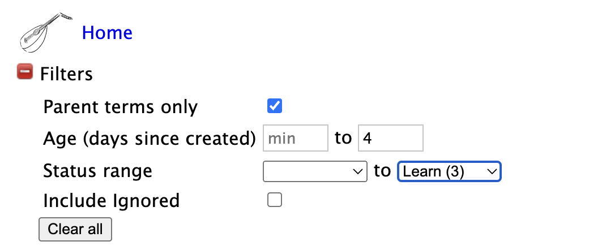

# Terms

On the Terms page (Home > Terms), Lute lists all the terms you've defined.

## Filtering

Lute shows all terms you've created, except for ones you've marked as "Ignored".

Sometimes it's useful to filter terms further.  The green plus sign next to "Filters" reveals extra filters you can apply.  For example, the filter below only includes parent terms created in the last 4 days up to "Learn (3)" status:

One possible use of filtering might be to filter for terms with Age max = 0, Status max = New after a day's reading, so you can do a quick review of new material.

Filters are applied _before_ the "Search" text is applied.

## Searching

You can search for terms using the "Search" text box.  You can use the special characters "^" and "$" to mark the start and end of strings, respectively.  This is useful when searching for terms with similar root forms.

Examples:

| Search | Returns |
| --- | --- |
| at | **at**, **at**tack, c**at** |
| ^at | **at**, **at**tack |
| at$ | **at**, c**at** |

## CSV Export

At the bottom of the term table listing is an "Export CSV" button.  This exports all the Terms that match the current filters and search.

> The CSV export is a simple tool that doesn't include sample sentences or images for the terms ... see [this issue](https://github.com/jzohrab/lute-v3/issues/3) for a description of a better feature that would take more work.