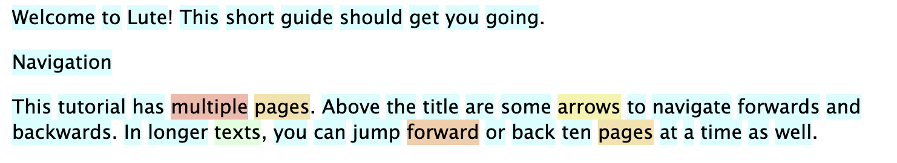
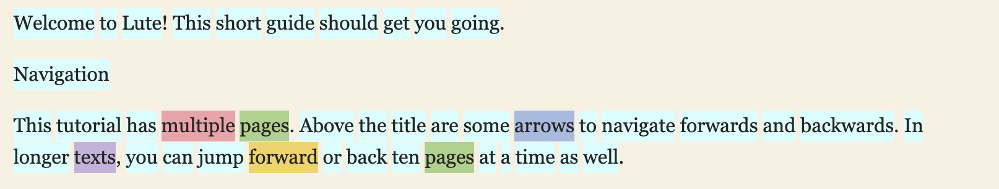
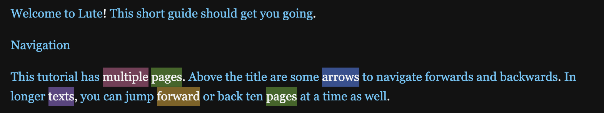

# Themes

_Added in Lute 3.0.2_

You can apply one of the predefined themes in the Settings.  Select the theme from the dropdown.

## The currently available themes

### Default

### Apple Books

### Dark slate

### Night

## "Change theme" hotkey - "m"

You can quickly cycle through the themes while reading by hitting the "m" hotkey.  Find what feels best.