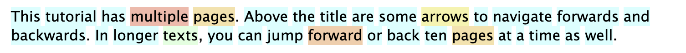
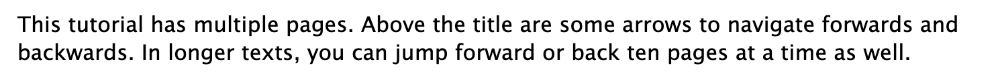

# Toggling highlights

On the Settings page is a "Highlight terms by status" checkbox.  If you uncheck that, the term status highlights are removed, except for when you mouseover the term.

Here is the default theme with term highlights:

Here is the same, without highlights:

If you hover over a term, or cursor through it, the highlight for that term is shown.

## Toggling highlight hotkey "h"

While reading, you can toggle term highlighting by pressing "h".